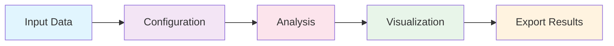

# User Guide

Welcome to the comprehensive PRISM User Guide. This section provides detailed information about all features and capabilities of PRISM.

## 📚 Guide Overview

<div class="grid cards" markdown>

-   :material-cog:{ .lg .middle } **[Configuration](configuration.md)**

    ---

    Learn how to configure PRISM for your specific needs, including parameter settings and environment setup

-   :material-file-document:{ .lg .middle } **[Input Files](input-files.md)**

    ---

    Understand supported file formats, data structures, and how to prepare your molecular dynamics data

-   :material-file-export:{ .lg .middle } **[Output Files](output-files.md)**

    ---

    Explore PRISM's output formats, data export options, and result interpretation

-   :material-chart-line:{ .lg .middle } **[Analysis Tools](analysis-tools.md)**

    ---

    Master PRISM's comprehensive suite of analysis functions for molecular dynamics

-   :material-eye:{ .lg .middle } **[Visualization](visualization.md)**

    ---

    Create stunning visualizations and interactive plots of your molecular systems

-   :material-rocket:{ .lg .middle } **[Performance](performance.md)**

    ---

    Optimize PRISM for maximum performance with large-scale simulations

</div>

## 🎯 Quick Navigation

### By Task

??? abstract "I want to analyze a trajectory"
    1. [Load your trajectory](input-files.md#loading-trajectories)
    2. [Choose analysis methods](analysis-tools.md#available-analyses)
    3. [Configure parameters](configuration.md#analysis-parameters)
    4. [Run analysis](analysis-tools.md#running-analyses)
    5. [Visualize results](visualization.md#plotting-results)

??? abstract "I want to visualize my system"
    1. [Load structure/trajectory](input-files.md#supported-formats)
    2. [Set up visualization](visualization.md#3d-visualization)
    3. [Customize appearance](visualization.md#customization)
    4. [Export images/movies](visualization.md#export-options)

??? abstract "I want to optimize performance"
    1. [Check system resources](performance.md#system-requirements)
    2. [Configure parallelization](performance.md#parallel-processing)
    3. [Enable GPU acceleration](performance.md#gpu-acceleration)
    4. [Monitor performance](performance.md#profiling)

### By Experience Level

=== "Beginner"

    Start with these essential topics:
    
    1. **[Basic Configuration](configuration.md#basic-setup)** - Simple setup for common tasks
    2. **[Common File Formats](input-files.md#common-formats)** - PDB, XYZ, DCD basics
    3. **[Simple Analyses](analysis-tools.md#basic-analyses)** - RMSD, RMSF, distances
    4. **[Basic Plotting](visualization.md#simple-plots)** - Line plots and histograms

=== "Intermediate"

    Expand your capabilities:
    
    1. **[Advanced Configuration](configuration.md#advanced-options)** - Custom parameters
    2. **[Complex Analyses](analysis-tools.md#advanced-analyses)** - Correlations, clustering
    3. **[Interactive Visualization](visualization.md#interactive-plots)** - 3D viewers, animations
    4. **[Batch Processing](performance.md#batch-processing)** - Multiple trajectories

=== "Advanced"

    Master PRISM's full potential:
    
    1. **[Custom Workflows](configuration.md#custom-workflows)** - Pipeline automation
    2. **[Machine Learning](analysis-tools.md#ml-integration)** - AI-powered analysis
    3. **[GPU Acceleration](performance.md#gpu-programming)** - CUDA optimization
    4. **[Plugin Development](../development/plugins.md)** - Extend PRISM

## 🔧 Core Concepts

### The PRISM Workflow



### Key Components

!!! info "Understanding PRISM Architecture"
    PRISM is built on four core pillars:
    
    1. **Data Management** - Efficient handling of molecular structures and trajectories
    2. **Analysis Engine** - Modular, extensible analysis framework
    3. **Visualization Suite** - Publication-ready graphics and interactive viewers
    4. **Performance Layer** - Optimized algorithms with GPU acceleration

## 📊 Common Use Cases

### Protein Dynamics Analysis

```python
from prism import Trajectory
from prism.analysis import ProteinAnalyzer

# Load protein trajectory
traj = Trajectory('protein.dcd', top='protein.pdb')

# Initialize analyzer
analyzer = ProteinAnalyzer(traj)

# Run comprehensive analysis
results = analyzer.full_analysis(
    include=['rmsd', 'rmsf', 'contacts', 'secondary_structure']
)

# Generate report
results.generate_report('protein_analysis.html')
```

### Membrane System Analysis

```python
from prism.analysis import MembraneAnalyzer

# Specialized membrane analysis
membrane = MembraneAnalyzer(traj)
membrane.calculate_thickness()
membrane.analyze_lipid_diffusion()
membrane.detect_pore_formation()
```

### Small Molecule Interactions

```python
from prism.analysis import LigandAnalyzer

# Analyze protein-ligand interactions
ligand = LigandAnalyzer(traj, ligand_resname='LIG')
binding = ligand.analyze_binding(
    protein_selection='protein',
    metrics=['contacts', 'hbonds', 'residence_time']
)
```

## 💡 Pro Tips

!!! tip "Performance Optimization"
    - Use **chunked reading** for large trajectories
    - Enable **parallel processing** for independent analyses
    - Leverage **GPU acceleration** for computationally intensive tasks
    - Cache intermediate results to avoid redundant calculations

!!! warning "Common Pitfalls"
    - Always verify unit consistency (Å vs nm)
    - Check periodic boundary conditions for distance calculations
    - Ensure proper alignment before RMSD calculations
    - Validate selections before running analyses

!!! success "Best Practices"
    - Document your analysis parameters
    - Use version control for analysis scripts
    - Validate results with known test cases
    - Keep raw data separate from processed results

## 📈 Performance Benchmarks

| Operation | Small (1K atoms) | Medium (10K atoms) | Large (100K atoms) |
|-----------|------------------|-------------------|-------------------|
| Load trajectory | < 1s | 2-5s | 10-30s |
| RMSD calculation | < 0.1s | 0.5s | 2-5s |
| RDF computation | 0.2s | 2s | 20s |
| Contact analysis | 0.1s | 1s | 10s |

*Benchmarks on standard hardware (Intel i7, 16GB RAM, no GPU)*

## 🔗 Related Resources

### Internal Documentation
- [API Reference](../api/index.md) - Detailed function documentation
- [Tutorials](../tutorials/index.md) - Step-by-step guides
- [Examples](../examples/index.md) - Ready-to-use code snippets

### External Resources
- [MDAnalysis Documentation](https://www.mdanalysis.org/)
- [Molecular Dynamics Fundamentals](https://www.ks.uiuc.edu/Training/Tutorials/)
- [Python Scientific Stack](https://scipy.org/)

## 🤝 Getting Help

If you need assistance:

1. Check the [FAQ](../about/faq.md)
2. Search [GitHub Issues](https://github.com/username/PRISM/issues)
3. Post on [Discussions](https://github.com/username/PRISM/discussions)
4. Contact the developer: [zhaoqi.shi@wisc.edu](mailto:zhaoqi.shi@wisc.edu)

---

<div class="grid" markdown>

[Configuration Guide :material-arrow-right:](configuration.md){ .md-button .md-button--primary }
[Analysis Tools :material-arrow-right:](analysis-tools.md){ .md-button }

</div>