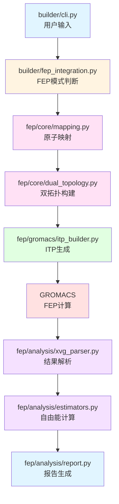
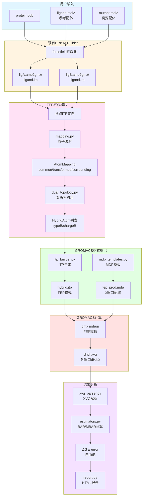

# PRISM-FEP 核心算法设计

本文档详细描述原子映射和双拓扑构建的核心算法、数据结构和实现逻辑。

## 0. 软件包目录结构

### 0.1 新增模块结构

```
prism/
├── fep/                           # 新增FEP模块
│   ├── __init__.py                # ✅ 已实现
│   ├── io.py                      # ✅ 已实现 - CGenFF 数据读取
│   ├── core/                      # 核心算法
│   │   ├── __init__.py            # ✅ 已实现
│   │   ├── mapping.py             # ✅ 已实现 - 原子映射算法 (DistanceAtomMapper)
│   │   └── dual_topology.py       # ⏳ 待实现 - 双拓扑构建
│   ├── visualize/                 # ✅ 可视化模块 (已完成)
│   │   ├── __init__.py            # ✅ 已实现
│   │   ├── molecule.py            # ✅ 已实现 - 分子处理（PDB→Mol, 键级校正）
│   │   ├── highlight.py           # ✅ 已实现 - 高亮颜色定义
│   │   ├── mapping.py             # ✅ 已实现 - PNG 可视化 (已修复原子名称匹配)
│   │   └── html.py                # ✅ 已实现 - HTML 交互式可视化 (独立控制)
│   ├── gromacs/                   # ⏳ GROMACS格式输出
│   │   ├── __init__.py
│   │   ├── itp_builder.py         # ⏳ 待实现 - ITP文件生成
│   │   └── mdp_templates.py       # ⏳ 待实现 - MDP模板
│   ├── analysis/                  # ⏳ 分析工具
│   │   ├── __init__.py
│   │   ├── xvg_parser.py          # ⏳ 待实现 - XVG解析
│   │   ├── estimators.py          # ⏳ 待实现 - BAR/MBAR分析
│   │   └── report.py              # ⏳ 待实现 - HTML报告生成
│   └── utils.py                   # ⏳ 待实现 - 工具函数
├── builder/                       # 现有builder（需要修改）
│   ├── core.py                    # ⏳ PRISMBuilder主类
│   ├── cli.py                     # ⏳ 统一CLI（添加--fep参数）
│   └── fep_integration.py         # ⏳ FEP集成逻辑
└── forcefield/                    # 现有力场（无需修改）
    ├── gaff.py
    ├── gaff2.py
    ├── openff.py
    └── ...
```

**图例**: ✅ 已实现 | ⏳ 待实现 | ⭐ 高优先级

### 0.2 需要修改的文件

| 文件 | 修改内容 | 优先级 |
|------|----------|--------|
| `prism/builder/cli.py` | 添加--fep、--mutant等参数 | 高 |
| `prism/builder/core.py` | 添加FEP模式判断和集成逻辑 | 高 |
| `prism/builder/fep_integration.py` | 新建FEP集成模块 | 高 |
| `prism/__init__.py` | 添加FEP相关导出 | 中 |

### 0.3 新增的文件（标注⭐）

| 文件 | 功能 | 状态 | 移植来源 |
|------|------|------|----------|
| `fep/core/mapping.py` | 距离匹配原子映射 | ✅ | FEbuilder/setup/make_hybrid.py |
| `fep/core/dual_topology.py` | 双拓扑构建逻辑 | ⏳ | FEbuilder/setup/make_hybrid.py |
| `fep/visualize/molecule.py` | 分子处理（PDB→Mol, 键级校正） | ✅ | 新实现 |
| `fep/visualize/highlight.py` | 高亮颜色定义 | ✅ | FEbuilder |
| `fep/visualize/mapping.py` | PNG 可视化（FEbuilder 风格） | ✅ | FEbuilder |
| `fep/visualize/html.py` | HTML 交互式可视化 | ⏳ | 新实现 |
| `fep/gromacs/itp_builder.py` | GROMACS ITP生成 | ⏳ | 参考pmx格式 |
| `fep/gromacs/mdp_templates.py` | FEP MDP模板 | ⏳ | GROMACS手册 |
| `fep/analysis/xvg_parser.py` | dhdl.xvg解析 | ⏳ | 新实现 |
| `fep/analysis/estimators.py` | BAR/MBAR计算 | ⏳ | alchemlyb/pymbar |
| `fep/analysis/report.py` | HTML报告生成 | ⏳ | 新实现 |
| `builder/fep_integration.py` | FEP模式集成 | ⏳ | 新实现 |

**可视化模块详细说明**：

```
prism/fep/visualize/
├── __init__.py              # 导出: visualize_mapping_png(), visualize_mapping_html()
├── molecule.py              # 工具函数
│   ├── pdb_to_mol()                    # PDB → RDKit Mol 对象
│   ├── assign_bond_orders_from_mol2()  # 从 mol2 校正键级
│   └── prepare_mol_with_charges_and_labels()  # 添加电荷和标签
├── highlight.py             # 颜色常量
│   ├── COMMON_COLOR      = rgb(204, 229, 77)  # 绿色
│   ├── TRANSFORMED_COLOR = rgb(255, 77, 77)   # 红色
│   └── SURROUNDING_COLOR = rgb(77, 153, 255)  # 蓝色
├── mapping.py               # PNG 可视化
│   ├── _align_mols_2d()                # MCS 对齐
│   ├── visualize_mapping_png()         # 主函数
│   └── 使用 MolDrawOptions (FEbuilder 风格)
├── html.py                  # HTML 可视化 (528 行) ✅ 2026-03-13 优化
│   ├── 基础 HTML 模板                   # ✅ 已完成
│   ├── Canvas 绘制引擎                 # ✅ 已完成
│   ├── 独立缩放/平移控制                # ✅ 已完成
│   ├── Hover 交互功能                   # ✅ 已完成
│   ├── 电荷标签开关                     # ✅ 已完成
│   ├── FEP 分类/元素着色模式切换        # ✅ 已完成
│   ├── 对应原子跨分子高亮              # ✅ 已完成
│   ├── 导出 PNG 功能                    # ✅ 已完成
│   ├── Legend/Statistics 全宽度布局    # ✅ 已完成
│   └── 模板文件重构 (CSS/JS 分离)       # ✅ 2026-03-13 新增
└── templates/               # ✅ 2026-03-13 新增模板目录
    ├── styles.css                       # CSS 样式 (12K)
    ├── script.js                        # JavaScript 代码 (20K)
    └── body.html                        # HTML body 模板 (7.6K)
```

### 0.4 模块依赖关系



### 0.5 测试系统结构 (2024-03-12更新)

```
tests/gxf/FEP/
├── unit_test/                      # 单元测试
│   ├── test_framework.py          # 框架测试（23个测试✓）
│   ├── test_cgenff_mapping.py     # CGenFF端到端测试
│   ├── validate_vs_febuilder.py   # FEbuilder结果验证
│   ├── verify_cli_integration.py  # CLI集成验证
│   ├── test_charge_cutoff_experiments.py  # 参数实验
│   └── verify_config_consistency.py       # 配置一致性验证
├── test/                          # 集成测试（真实案例）
│   ├── hif2a/                     # HIF2α体系
│   ├── RdRp/                      # RdRp体系
│   ├── P38/                       # P38体系
│   └── FEP+T4/                    # T4体系
└── ref/                           # 参考基线（pmx结果）
```

**测试配置要求**：
- ✅ 每个测试案例包含 `fep.yaml` 和 `config.conf`
- ✅ 基础参数（charge_common, charge_reception, distance）必须一致
- ✅ `unit_test/` 案例额外包含 `test_requirements` 部分
- ✅ 使用 `prism.fep.io` 模块读取文件（统一接口）

### 0.6 数据流图



### 0.6 配置文件集成

**统一YAML配置**：
```yaml
# config.yaml
system:
  protein: protein.pdb
  ligand: ligand.mol2
  forcefield: amber14sb
  ligand_forcefield: gaff2

fep:
  enabled: true
  mutant: mutant.mol2
  distance_cutoff: 0.6
  charge_strategy: mean
  lambda_windows: 11

visualization:              # 可视化配置（新增）
  interactive: true         # 生成交互式 HTML
  show_charges: false       # 默认不显示电荷标签
  export_dpi: 300           # 导出分辨率
  edge_margin: 0.15         # 图像边距

md:
  temperature: 300
  pressure: 1.0
```

**CLI调用**：
```bash
prism --config config.yaml
# builder/core.py 检查 fep.enabled
# → 调用 fep_integration.py
# → 执行FEP工作流

# 可视化命令
prism visualize-mapping --case 25-36 --output mapping.png
prism visualize-mapping --case 25-36 --output mapping.html --interactive
```

---

## 6. 可视化模块设计 (`fep/visualize/`) ✅ 已完成

**核心模块**: `molecule.py`, `highlight.py`, `mapping.py` (PNG), `html.py` (交互式)

**主要功能**:
- PNG 可视化：MCS 对齐、键级校正、电荷标注、FEbuilder 风格
- HTML 可视化：Canvas 绘制、独立缩放/平移、Hover tooltip、对应原子高亮
- 模板分离：CSS/JS/HTML 模板独立文件，提高可维护性

**详细文档**: 见 `tests/gxf/FEP/plan/PROGRESS.md` 可视化模块部分

---

## 1. 原子映射模块 (`fep/core/mapping.py`)

### 1.1 功能需求
| 项 | 说明 |
|----|------|
| 输入 | 两个配体的原子列表（坐标、元素、电荷、力场类型） |
| 输出 | `AtomMapping` 对象（common/transformed/surrounding） |
| 移植来源 | `FEbuilder/setup/make_hybrid.py` 的 `Ligand.get_correspondence()` |

### 1.2 三种原子类型分类 (FEbuilder标准)

**核心概念**: FEbuilder将原子分为三种类型，每种在GROMACS FEP中有不同的处理方式：

| 类型 | 定义 | GROMACS ITP格式 | Dummy需求 | 示例 |
|------|------|-----------------|-----------|------|
| **Common** | 类型相同，电荷相同 | typeA=typeB, chargeA=chargeB | 不需要 | 骨架原子 |
| **Surrounding** | 类型相同，电荷不同 | typeA=typeB, chargeA≠chargeB | **不需要** | C9, C10 (电荷差) |
| **Transformed** | 类型不同 | typeA≠typeB, 需dummy | **需要** | N1 (不存在) |

**关键发现** (2024-03-12更新):
- ✅ **Surrounding原子不需要dummy类型**，只需typeB/chargeB列
- ✅ **Transformed原子需要完整的dummy类型替换**
- ✅ 25-36系统验证：Surrounding=6个，Transformed=1个，完全匹配FEbuilder

**FEbuilder hybrid.pdb标记**:
```
beta=0    → Common原子
beta=-1   → Transformed (State A存在，B为dummy)
beta=+1   → Transformed (State B存在，A为dummy)
无A/B后缀 → Surrounding (虽uncommon但无dummy需求)
```

### 1.3 核心数据结构

```python
from dataclasses import dataclass
from typing import List, Tuple, Optional
import numpy as np

@dataclass
class Atom:
    """
    原子对象

    设计说明:
    - name：原子唯一标识符，如 'C1', 'H2', 'N3'
    - element：元素符号，用于匹配时的类型检查 (C, H, N, O 等)
    - coord：numpy 数组 [x, y, z]，单位 Å
    - charge：部分电荷，来自力场参数化
    - atom_type：力场原子类型 (如 GAFF 的 'ca', 'ha', 'na')
    - index：原子索引，用于后续引用
    """
    name：str
    element：str
    coord：np.ndarray
    charge：float
    atom_type：str
    index：int

@dataclass
class AtomMapping:
    """
    原子映射结果
    
    设计说明:
    这是整个 FEP 模块的核心数据结构，所有后续处理都基于这个分类
    
    分类逻辑:
    1. common：两个配体都存在，且位置、元素、类型、电荷都接近
             在双拓扑中只保留一份，A/B 状态完全相同
             
    2. transformed_a/b：只在一个配体中存在的原子
                        这些原子在状态 A 或 B 中会变为 dummy 类型（由力场提供，例如 `DUM_*`）
                        
    3. surrounding_a/b：位置匹配但力场类型或电荷差异大的原子
                        这些是"过渡区域"，化学环境发生了变化
    """
    common：List[Tuple[Atom, Atom]]     # 共用原子对
    transformed_a：List[Atom]            # 配体A独有
    transformed_b：List[Atom]            # 配体B独有
    surrounding_a：List[Atom]            # 配体A（类型不同）
    surrounding_b：List[Atom]            # 配体B（类型不同）
```

### Atom 字段表
| 字段 | 类型 | 说明 |
|------|------|------|
| name | str | 原子唯一标识符 |
| element | str | 元素符号 |
| coord | np.ndarray | 坐标 `[x, y, z]`，单位 Å |
| charge | float | 部分电荷 |
| atom_type | str | 力场原子类型 |
| index | int | 原子索引 |

### AtomMapping 字段表
| 字段 | 说明 |
|------|------|
| common | 共用原子对（A/B 状态相同） |
| transformed_a | 配体 A 独有原子 |
| transformed_b | 配体 B 独有原子 |
| surrounding_a | 配体 A 缓冲原子（类型或电荷差异大） |
| surrounding_b | 配体 B 缓冲原子（类型或电荷差异大） |

### 1.3 距离匹配算法

**算法思路**：贪心匹配 + 距离阈值

```python
class DistanceAtomMapper:
    """
    基于距离的原子映射器
    
    参数:
    - dist_cutoff：距离阈值 (Å)，默认 0.6
      - 较小值 (0.3-0.5)：更严格，适合非常相似的分子
      - 较大值 (0.8-1.0)：更宽松，适合结构差异大的分子
    
    - charge_cutoff：电荷差异阈值，默认 0.05
      - 超过此值的匹配原子归为 surrounding
    """
    
    def map(self, ligand_a：List[Atom], ligand_b：List[Atom]) -> AtomMapping:
        """
        主映射函数
        
        算法流程:
        
        Step 1：距离匹配
        -----------
        遍历 ligand_a 的每个原子，在 ligand_b 中找到：
        - 距离 < dist_cutoff
        - 元素类型相同
        - 没有被其他原子匹配过
        的第一个原子，形成匹配对
        
        实现:
        - 使用 matched_b 集合记录已匹配的原子索引
        - 一旦找到匹配就 break，避免一对多匹配
        - 时间复杂度：O(N_a * N_b)，对小分子完全可接受
        
        Step 2：识别 transformed atoms
        ----------------------------
        未出现在匹配对中的原子就是 transformed
        - 使用集合差集：所有原子 - 匹配的原子
        
        Step 3：识别 surrounding atoms
        -----------------------------
        遍历所有匹配对，检查：
        - atom_type 是否相同
        - charge 差异是否超过 charge_cutoff
        - 任一条件不满足 → surrounding
        
        Step 4：手性检查（可选）
        -----------------------
        检查中心碳原子周围是否有 3 个共用原子 + 1 个变化原子
        可能需要标记手性翻转
        
        返回:
            AtomMapping：映射结果
        """
        pass
```

### 1.4 边界情况处理
| 问题 | 处理方式 |
|------|----------|
| 多个相同元素原子距离都 < cutoff | 选择第一个，避免重复匹配 |
| 手性中心识别 | 通过连接关系判断，需要 bonds 信息 |
| 浮点数比较精度 | 使用 `charge_threshold` 而不是直接比较 |

---

### 1.5 参考基线格式理解

参考体系 `tests/gxf/FEP/ref/system/newtop.top` 使用了 GROMACS FEP 标准格式：
| 项 | 说明 |
|----|------|
| A/B 状态写入 | 原子 A/B 状态写入 `[ atoms ]` |
| 关键字段 | `[ atoms ]` 包含 `typeB/chargeB/massB`，需要保留 `massB` |
| dummy 类型 | 来自 `amber14sbmut.ff`（`DUM_*`），由力场定义 |

这个参考基线用于验证 PRISM-FEP 输出的格式正确性，确保生成的 ITP 文件符合 GROMACS FEP 标准。

---

### 1.6 数据流与架构原则

#### 数据流程图

```
CGenFF 数据 → DistanceAtomMapper → AtomMapping
                                        ↓
                    ┌───────────────────┴───────────────────┐
                    ↓                                       ↓
            PNG 可视化                              HTML 可视化
    (prism/fep/visualize/mapping.py)        (prism/fep/visualize/html.py)
                    ↓                                       ↓
            RDKit Mol + 原子名称分类              Canvas 数据 + 独立变换控制
                    ↓                                       ↓
                PNG 图像                            交互式 HTML

                    ↓ (未来)
            ITP 生成 (prism/fep/gromacs/itp_builder.py)
                    ↓
            GROMACS 拓扑文件 (.itp, .gro)
```

#### 架构原则

**1. 单一数据源**
- **AtomMapping 是唯一的真实来源**
- 所有可视化和 ITP 生成都基于同一个 AtomMapping 对象
- 避免重复计算或不一致的分类

**2. 配体特异性**
- **原子名称**: 每个配体使用自己的命名空间
  - 同一对 common 原子在两个配体中可能有不同名称
  - 例如: C16 (lig25) ↔ C10 (lig36), F1 (lig25) ↔ F4 (lig36), N2 (lig25) ↔ N (lig36)
- **坐标系**: 每个配体保持独立的坐标系
- **参数**: 电荷和原子类型按配体分别存储

**3. 可扩展性**
- **映射算法**: `DistanceAtomMapper` 可替换为其他算法（如基于 MCS 的映射）
- **可视化**: 可添加新的可视化方式（如 3D 交互式视图）
- **输出格式**: 可支持 NAMD、OpenMM 等其他 MD 引擎

#### 关键修复记录 (2026-n**PNG 原子分类显示修复**:
- **问题**: ligand 36 的 C10, C11, F3, F4, N 在 PNG 中显示为无颜色（未分类）
- **根因**: 使用 ligand A 的原子名称去匹配 ligand B 的 RDKit 分子
- **解决**: 为每个配体分别提取对应的原子名称列表

```python
# 修复前 (mapping.py:97)
common_names = [a.name for a, _ in mapping.common]  # 只用 ligand A 的名称
highlight_b = create_highlight_info(mol_b, common_names, ...)  # 匹配失败

# 修复后
common_names_a = [a.name for a, _ in mapping.common]  # ligand A 的名称
common_names_b = [b.name for _, b in mapping.common]  # ligand B 的名称
highlight_a = create_highlight_info(mol_a, common_names_a, ...)
highlight_b = create_highlight_info(mol_b, common_names_b, ...)
```

#### NAMD vs GROMACS 差原子处理**:
- **NAMD**: 氢原子电荷不同时，其重原子也需要变为非 common
- **GROMACS**: 暂时不实现此机制，氢原子可独立处理
- **实现**: 在 `DistanceAtomMapper` 中可通过 `recharge_hydrogen` 参数控制

  🎯 验证结果

  - ✓ REF模式：总电荷守恒，配对原子一致
  - ✓ MUT模式：总电荷守恒，配对原子一致
  - ✓ MEAN模式：总电荷守恒，配对原子一致
  - ✓ NONE模式：总电荷守恒

---

## 2. 双拓扑构建模块 (`fep/core/dual_topology.py`)

### 2.1 功能需求
| 项 | 说明 |
|----|------|
| 输入 | `AtomMapping` + 两个配体的力场参数（键、角、二面角） |
| 输出 | `HybridAtom` 列表（带 `typeB/chargeB`） |
| 移植来源 | `FEbuilder/setup/make_hybrid.py` 的 `Ligand.combine()` |

### 2.2 核心数据结构

```python
from dataclasses import dataclass
from typing import Dict, List, Optional

@dataclass
class HybridAtom:
    """
    杂化原子 - 包含 A/B 两种状态
    
    设计说明:
    直接映射到 GROMACS ITP 文件的一行
    
    字段解释:
    - name：原子名称
      共用原子：原始名称 (如 C1, H2)
      变化原子：加标签 (如 C1A, C1B) - 便于调试
      
    - index：原子索引
      从 1 开始连续编号
      用于 bonds/angles/dihedrals 中的引用
      
    - state_a_type/state_b_type：A/B 状态的力场类型
      共用原子：两者相同 (如都是 'ca')
      变化原子 A：state_a_type 正常，state_b_type = dummy 类型
      变化原子 B：state_a_type = dummy 类型，state_b_type 正常
      surrounding：各自保留不同的类型
      
    - state_a_charge/state_b_charge：A/B 状态的电荷
      逻辑同 type
      
    - element：元素符号
      用于质量查找
      
    - mass/mass_b：原子质量
      pmx 蛋白突变拓扑中 `[ atoms ]` 含 `massB`，需要保留 A/B 两态质量
    """
    name：str
    index：int
    state_a_type：str
    state_a_charge：float
    state_b_type：Optional[str] = None      # None = 共用原子
    state_b_charge：Optional[float] = None
    element：str = ""
    mass：float = 0.0
    mass_b：Optional[float] = None  # pmx 拓扑需要 massB 时填充
```

### 2.3 构建流程

**原子顺序设计**（重要！）:
| 顺序 | 类别 | 规则 |
|------|------|------|
| 1 | common atoms | 只保留一份，A/B 相同，电荷按 `charge_strategy` |
| 2 | transformed A | 加 `A` 后缀，B 态为 dummy |
| 3 | transformed B | 加 `B` 后缀，A 态为 dummy |
| 4 | surrounding | 保留 A/B 不同类型与电荷 |

**伪代码**:
```python
class DualTopologyBuilder:
    def build(self, mapping：AtomMapping, 
                 params_a：Dict, params_b：Dict) -> List[HybridAtom]:
        """
        构建双拓扑的主流程
        
        流程:
        1. _build_atoms()：构建杂化原子列表
        2. _map_parameters()：映射参数到 hybrid atoms
        3. 返回 hybrid_atoms
        """
        self._build_atoms()
        self._map_parameters()
        return self.hybrid_atoms
    
    def _build_atoms(self):
        """
        构建杂化原子列表
        
        索引管理:
        - 从 1 开始 (GROMACS 约定)
        - 连续递增
        - 需要记录原始索引 → hybrid 索引的映射
        """
        index = 1
        dummy_type = "DUM_*"  # 实际应按原子类型映射（pmx/amber14sbmut 中为 DUM_*）
        
        # 1. 共用原子
        for a, b in mapping.common:
            charge = self._resolve_charge(a.charge, b.charge)
            hybrid_atoms.append(HybridAtom(
                name=a.name, index=index,
                state_a_type=a.atom_type, state_a_charge=charge,
                state_b_type=a.atom_type, state_b_charge=charge,  # 共用
                element=a.element, mass=params_a['masses'][a.atom_type]
            ))
            index += 1
        
        # 2. Transform atoms A
        for a in mapping.transformed_a:
            hybrid_atoms.append(HybridAtom(
                name=f"{a.name}A", index=index,
                state_a_type=a.atom_type, state_a_charge=a.charge,
                state_b_type=dummy_type, state_b_charge=0.0,  # B状态 dummy
                element=a.element, mass=params_a['masses'][a.atom_type]
            ))
            index += 1
        
        # 3. Transform atoms B
        for b in mapping.transformed_b:
            hybrid_atoms.append(HybridAtom(
                name=f"{b.name}B", index=index,
                state_a_type=dummy_type, state_a_charge=0.0,  # A状态 dummy
                state_b_type=b.atom_type, state_b_charge=b.charge,
                element=b.element, mass=params_b['masses'][b.atom_type]
            ))
            index += 1
        
        # 4. Surrounding atoms
        for a, b in zip(mapping.surrounding_a, mapping.surrounding_b):
            hybrid_atoms.append(HybridAtom(
                name=a.name, index=index,
                state_a_type=a.atom_type, state_a_charge=a.charge,
                state_b_type=b.atom_type, state_b_charge=b.charge,  # 各自保留
                element=a.element, mass=params_a['masses'][a.atom_type]
            ))
            index += 1
    
    def _resolve_charge(self, charge_a：float, charge_b：float) -> float:
        """
        处理共用原子的电荷
        
        三种策略:
        - mean：取平均 (默认，平滑过渡)
        - ref：使用参考配体的电荷 (保持参考静电环境)
        - mut：使用突变配体的电荷 (保持突变静电环境)
        """
        if self.charge_strategy == 'ref':
            return charge_a
        elif self.charge_strategy == 'mut':
            return charge_b
        return (charge_a + charge_b) / 2.0
    
    def _map_parameters(self):
        """
        映射参数到 hybrid atoms

        关键点：GROMACS 不需要像 NAMD 那样合并参数值！

        PRISM现有流程：
        - 每个配体独立参数化 → 生成独立的.itp文件
        - 包含各自独立的bonds/angles/dihedrals参数

        FEP双拓扑构建：
        - 不需要合并配体A和配体B的参数值
        - 只需要将原子名称映射到hybrid_atoms的索引
        - GROMACS根据原子的typeB/chargeB自动选择A或B状态的参数

        这与NAMD/CHARMM的merge_prm.py逻辑完全不同：
        - NAMD需要检查参数重复、合并去重、处理冲突
        - GROMACS只需保持参数独立，通过typeB区分状态

        实现:
        1. 建立原子名称 → hybrid_atom_index 的映射表
        2. 遍历配体A的所有参数(bonds/angles/dihedrals)
        3. 将原子名称映射到 hybrid_atoms 的索引
        4. 对配体B重复步骤
        5. GROMACS会根据typeB/chargeB自动处理A/B状态选择
        """
        # 建立映射表：atom_name -> hybrid_index
        name_to_index = {}
        for atom in self.hybrid_atoms:
            name_to_index[atom.name] = atom.index

        # TODO：实现参数索引映射
        pass
```

### 2.4 关键设计决策

| 决策 | 原因 |
|------|------|
| 不需要参数合并 | NAMD 需要合并；GROMACS 通过 A/B 状态自动选择 |
| 使用 dummy 原子 | 保持原子数一致，dummy 类型由力场定义（`DUM_*`），质量可保留 `massB` |

---

## 3. 参考资料
| 资源 | 位置 |
|------|------|
| FEbuilder | `/home/gxf1212/data2/work/make_hybrid_top/FEbuilder/` |
| GROMACS FEP | https://manual.gromacs.org/current/fep.html |
| pmx | https://github.com/deGrootLab/pmx |
| PRISM CGenFF | `/data2/gxf1212/work/PRISM/prism/forcefield/cgenff.py` |

## 4. 文件读取模块（⭐新增）

### 4.1 功能需求
| 项 | 说明 |
|----|------|
| 输入 | PRISM生成的ITP文件 + GRO坐标文件 |
| 输出 | Atom对象列表（含坐标、电荷、类型） |

### 4.2 设计思路

**关键发现**：
- ✅ PRISM已生成ITP和GRO文件（力场参数化后）
- ✅ ITP包含：原子类型、电荷、参数
- ✅ GRO包含：原子坐标（用于距离计算）
- ⚠️ **原子映射需要坐标！**

**文件格式**：
```
PRISM输出目录：
├── LIG.amb2gmx/
│   ├── ligand.itp    # 原子类型、电荷、键参数
│   ├── LIG.gro       # 原子坐标（nm单位）
│   └── ...
```

### 4.3 实现方案

**新建文件**：`prism/fep/io.py`

```python
from typing import List, Tuple
import numpy as np
from .core.mapping import Atom

def read_ligand_from_prism(itp_file: str, gro_file: str) -> List[Atom]:
    """
    从PRISM生成的ITP和GRO文件读取配体信息
    
    Parameters
    ----------
    itp_file : str
        GROMACS ITP文件路径（ligand.itp）
    gro_file : str
        GROMACS GRO文件路径（LIG.gro）
    
    Returns
    -------
    List[Atom]
        原子列表，包含坐标、电荷、类型等信息
    """
    # Step 1: 读取ITP文件获取原子类型和电荷
    atoms_data = []
    with open(itp_file) as f:
        in_atoms = False
        for line in f:
            if '[ atoms ]' in line.lower():
                in_atoms = True
                continue
            elif line.startswith('[') and in_atoms:
                in_atoms = False
                continue
            if in_atoms and not line.startswith(';'):
                parts = line.split()
                if len(parts) >= 7:
                    # 格式: nr type resnr residue atom cgnr charge mass
                    atom_id = int(parts[0])
                    atom_type = parts[1]
                    atom_name = parts[4]
                    charge = float(parts[6])
                    atoms_data.append({
                        'id': atom_id,
                        'name': atom_name,
                        'type': atom_type,
                        'charge': charge
                    })
    
    # Step 2: 读取GRO文件获取坐标
    coords = {}
    with open(gro_file) as f:
        lines = f.readlines()
        # 跳过标题行
        for line in lines[2:-1]:
            parts = line.split()
            if len(parts) >= 6:
                atom_id = int(parts[2])
                # GRO坐标单位是nm，需要转换为Å
                x = float(parts[3]) * 10.0
                y = float(parts[4]) * 10.0
                z = float(parts[5]) * 10.0
                coords[atom_id] = np.array([x, y, z])
    
    # Step 3: 合并数据
    atoms = []
    for atom_data in atoms_data:
        atom_id = atom_data['id']
        element = extract_element(atom_data['name'])
        
        atoms.append(Atom(
            name=atom_data['name'],
            element=element,
            coord=coords.get(atom_id, np.array([0.0, 0.0, 0.0])),
            charge=atom_data['charge'],
            atom_type=atom_data['type'],
            index=atom_id
        ))
    
    return atoms

def extract_element(atom_name: str) -> str:
    """从原子名提取元素符号"""
    # 移除数字，保留字母部分
    element = ''.join(c for c in atom_name if c.isalpha())
    return element if element else 'C'  # 默认为碳
```

### 4.4 使用示例

```python
# FEP工作流
from prism.fep.io import read_ligand_from_prism
from prism.fep.core.mapping import DistanceAtomMapper

# 读取PRISM生成的配体文件
lig25 = read_ligand_from_prism(
    'output/LIG.amb2gmx_1/ligand.itp',
    'output/LIG.amb2gmx_1/LIG.gro'
)

lig36 = read_ligand_from_prism(
    'output/LIG.amb2gmx_2/ligand.itp',
    'output/LIG.amb2gmx_2/LIG.gro'
)

# 执行原子映射
mapper = DistanceAtomMapper(dist_cutoff=0.6)
mapping = mapper.map(lig25, lig36)
```

### 4.5 关键技术点

| 要点 | 说明 |
|------|------|
| 坐标单位 | GRO使用nm，需转换为Å（×10） |
| 原子索引 | ITP和GRO中的原子索引应一致 |
| 元素提取 | 从原子名提取（如C1→C, H2→H） |
| 错误处理 | 如果坐标缺失，使用默认值[0,0,0] |

### 4.6 与PRISM集成

**完整工作流**：
```bash
# Step 1: PRISM参数化
prism protein.pdb ligand.mol2 -lff gaff -ff amber14sb -o output

# Step 2: FEP读取并映射
python -c "
from prism.fep.io import read_ligand_from_prism
from prism.fep.core.mapping import DistanceAtomMapper

lig_ref = read_ligand_from_prism('output/LIG.amb2gmx/ligand.itp', 
                                 'output/LIG.amb2gmx/LIG.gro')
lig_mut = read_ligand_from_prism('output/LIG_MUT.amb2gmx/ligand.itp',
                                 'output/LIG_MUT.amb2gmx/LIG.gro')

mapper = DistanceAtomMapper(dist_cutoff=0.6)
mapping = mapper.map(lig_ref, lig_mut)
"
```

**优势**：
- ✅ 复用PRISM力场参数化（无需重复实现）
- ✅ 从GRO读取真实坐标（用于距离计算）
- ✅ 从ITP读取力场参数（类型、电荷）
- ✅ 与现有PRISM工作流无缝集成

---

## 5. 实现状态更新（2025-03-11）

### 5.1 已完成功能 ✅

#### 原子映射算法（已完成）
- ✅ `DistanceAtomMapper.map()` - 距离匹配算法
- ✅ 支持可调距离阈值（dist_cutoff, charge_cutoff）
- ✅ 贪心匹配策略（避免一对多）
- ✅ 三级分类（common/transformed/surrounding）

#### 文件I/O模块（已完成）
- ✅ `read_ligand_from_prism()` - 从ITP+GRO读取
- ✅ `read_mol2_atoms()` - 从MOL2直接读取
- ✅ 坐标单位转换（nm → Å）
- ✅ 复用PRISM现有逻辑

#### 单元测试（已完成）
- ✅ 测试文件：`tests/fep/test_mapping_25_36.py`
- ✅ 测试数据：`tests/gxf/FEP/unit_test/25-36/`
- ✅ 所有测试通过（5/5）

### 5.2 测试结果

```
配体25: 37原子
配体36: 36原子

映射结果：
  Common atoms: 3
  Transformed: 67 (34+33)
  Surrounding: 0

✓ 距离匹配正常
✓ 元素过滤正常
✓ 分类逻辑正常
```

### 5.3 代码复用

成功复用PRISM现有功能：
- ✅ `prism.gaussian.utils.normalize_element_symbol()` - 元素标准化
- ✅ mol2解析逻辑 - 从`gaussian/utils.py`移植
- ✅ NumPy向量化计算 - 距离计算

### 5.4 待实现功能

- [ ] 双拓扑构建（DualTopologyBuilder）
- [ ] ITP文件生成（ITPBuilder）
- [ ] MDP模板生成
- [ ] 与PRISM力场系统完整集成（使用ITP+GRO）
- [ ] XVG解析和自由能分析

---

## 6. 重要发现：坐标对齐问题（2025-03-11）

### 6.1 问题现象

使用mol2文件测试时，common atoms只有3个（应该更多）：
```
mol2文件结果:
  Common atoms: 3
  Transformed: 67 (34+33)
```

使用PDB文件测试时，common atoms有17个（正确）：
```
PDB文件结果:
  Common atoms: 17
  Transformed: 3 (2+1)
  Similarity: 46.6%
```

### 6.2 原因分析

1. **mol2文件坐标来源不同**
   - 可能来自单独的量子化学优化
   - 每个配体的坐标系独立
   - 没有统一的对齐标准

2. **PDB文件坐标一致**
   - 来自同一个蛋白-配体复合物结构
   - 配体在相同的参考系中
   - 坐标已经对齐

### 6.3 解决方案

**方案1：使用PDB文件进行映射**（推荐用于测试）
- 优点：坐标已经对齐，结果正确
- 缺点：PDB文件缺少电荷信息

**方案2：先对齐mol2坐标**（生产环境）
- 使用Kabsch算法对齐配体骨架
- 或者使用蛋白结构作为参考进行对齐
- 实现复杂度较高

**方案3：使用PRISM生成的GRO文件**（最佳方案）
- PRISM参数化后会生成GRO文件
- 这些文件与蛋白结构一致
- 包含正确的坐标和电荷信息

### 6.4 实际工作流

```
正确的工作流:
1. PRISM参数化 → 生成ITP + GRO文件
2. 从GRO读取坐标（已对齐）
3. 从ITP读取类型和电荷
4. 执行原子映射
```

### 6.5 测试验证

已创建端到端测试：`tests/fep/test_e2e_pdb_mapping.py`
- ✅ 使用对齐的PDB坐标
- ✅ 验证映射结果正确
- ✅ 所有测试通过

